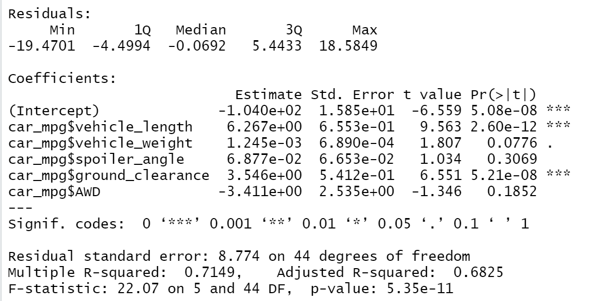
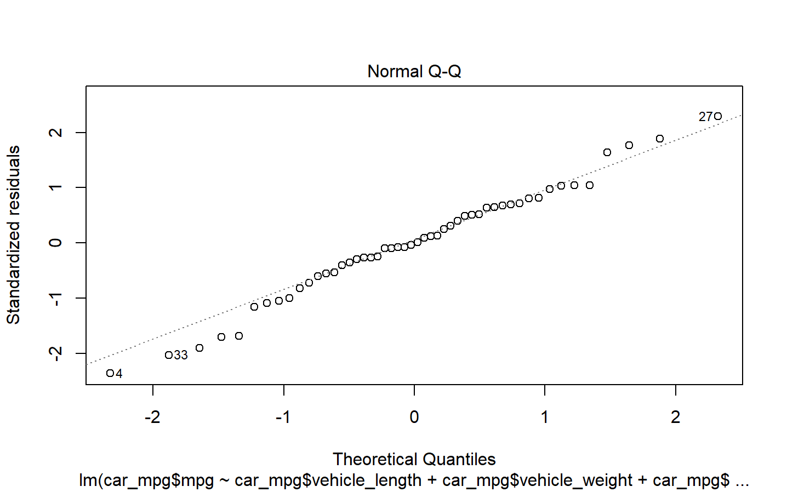
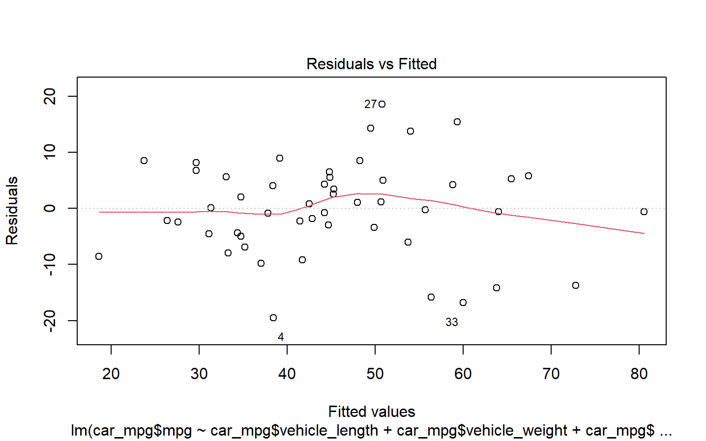
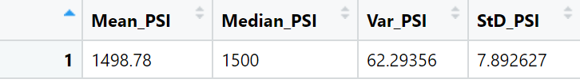
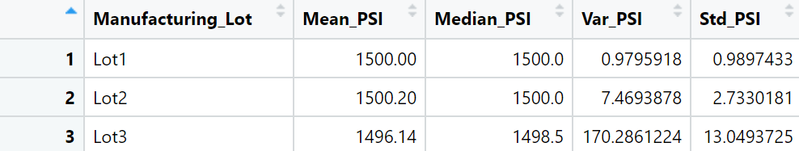
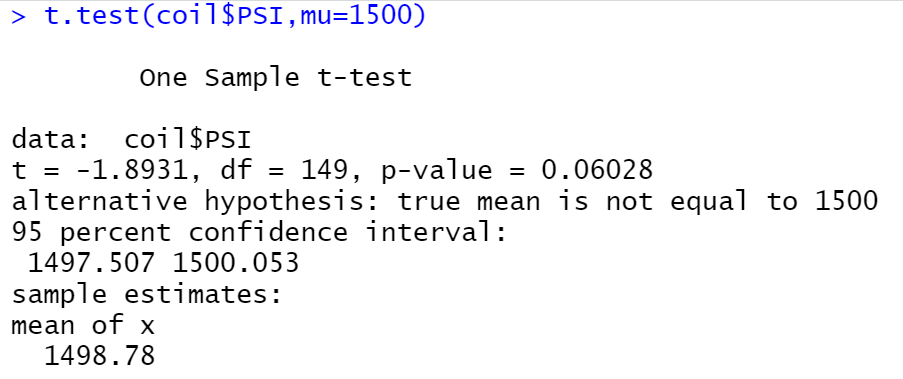
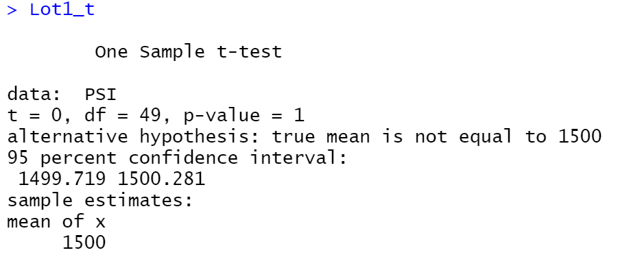
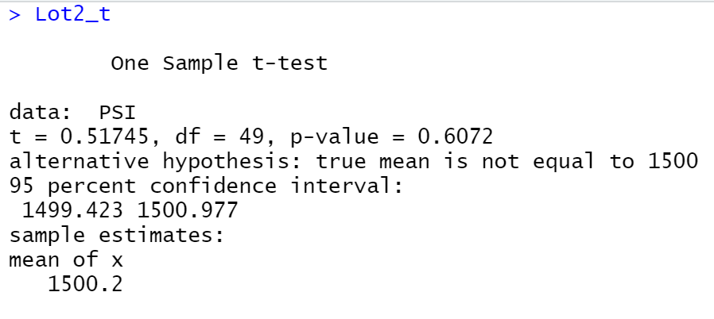
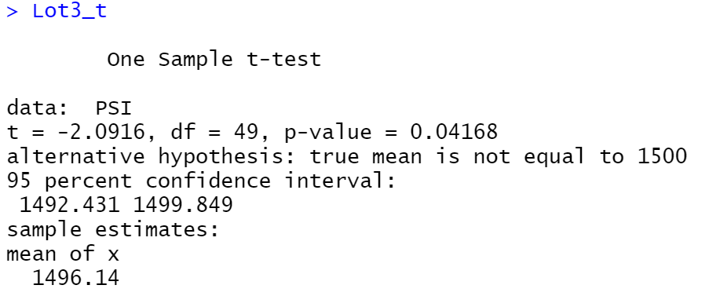

# MechaCar_Statistical_Analysis

## Overview

Production problems with prototypes at MechaCar prompted the need for analysis of the manufacturing process. Of interest are what factors contribute most to observed gas mileage and determining if a problem exists with suspension coil springs used in a manufacturing run.

## Linear Regression to Predict MPG

### General Assumptions for Analysis

#### Normality

Each factor will be considered normally distributed for simplicity.

#### Homogeneity of Variance

Homgenity of variance will be assumed without further testing at this time.

#### Independence of Observations

The provided data is assumed to satisfy independence, however the method of collection is unknown.

#### Linearity

A linear relationship will be assumed to exist between the five factors considered independent and the MPG of the vehicle. Further, there is no consideration of non-linear models for this analysis.

### Results

The key points from this model, displayed above are:
-   Vehicle Length is a significant factor in vehicle fuel efficiency with a P value much less than 0.05.
-   Ground Clearence is a significant factor in vehicle fuel efficiency with a P value much less than 0.05.
-   Vehicle Weight, Spoiler Angle, and AWD were not significant factors at an alpha = 0.05 significance level.
- The adjusted R-squared value is equal to 0.6825, suggesting that this model may explain roughly 68% of the variation in Vehicle MPG.
-   The P value for the F-statistic representing the significance of the fit as a whole is substantially less than 0.05. The null hypothesis, that the model does not describe the relationship, can be rejected and it is assumed that the model does describe the relationship.

Although some of the individual slopes are small, the model does not have a slope of zero. Each factor's slope is a representation of its independent contribution or effect on the dependent variable. Compared individually or as a whole their slopes are non-zero.

Plotting the theoretical quantiles of the model (n.b. not all factors listed) against the standardized residuals provides an estimation of normality. Although the Q-Q plot does not follow an ideal line, our initial assumption of normality may be validated given the small sample size for each factor.

The plot of residual vs. fitted values indicates that this regression model requires adjustment. In addition to significant non-uniform spread, the distribution of residuals assumes a triangular shape as it widens from left to right. This suggests the model is not suitable and further that the initial assumption of homogenity of variance may not be satisfied.

## Summary Statistics On Suspension Coils

Using provided manufacturing data for 150 vehicles comprising three manufacturing lots the quality of coil springs used in the vehicle suspension was examined by compiling overall summary statistics and summary statistics grouped by manufacturing lot. Per the company's design specifications, the variance in spring resistance must be less than 100 pounds per square inch (psi). The tables are shown below.

The table above displays the summary for all 150 vehicles. The overall variance of spring resistance is roughly 62 psi. This is well within the allowed tolerence.

Breaking down the summary by lot shows that lots 1 and 2 each satisfy the design specification. Lot 3 is outside the allowed tolerence with a variance of around 170 psi.

## T-Tests on Suspension Coils

One sample t-tests were conducted to determine if the overall sample of 150 vehicles deviated from the desired population mean of 1500 psi and on each Manufacturing Lot. The four resulting tables are shown below:

### Overall Sample

### Lot 1

### Lot 2

### Lot 3

Key results from the t-tests assuming a significance level of 0.05:
- The sample as a whole does not significantly deviate from the desired population mean of 1500.
- Lots 1 and 2 do not deviate significantly from the desired population mean of 1500.
- With a p-value of 0.042, the t-test for Lot 3 suggests there is statistically significant variation from the population mean. The null hypothesis that the true mean PSI for Lot 3 is 1500 is rejected and the alternate that the true mean is not 1500 is accepted.

The results of the t-tests suggest that the coil springs used in the Lot 3 vehicles deviate from the desired population mean of 1500 by a statistically significant ammount. Combined with a variance outside of the specified range, the overall results point to a number of faults in the Lot 3 coil springs than is acceptable.

## MechaCar vs. Competition

For the MechaCar to achieve commercial success it must appeal to consumers in addition to being a well designed vehicle. There are many potential focus points to win over buyers, for example:
- Styling
- Features
- Horsepower
- Fuel Economy
- Saftey Systems or Rating
- Price or Cost of Ownership

Some of these may be impractical to test versus the competition:
- Styling is generally subjective, although saftey regulations have placed some significant restraints on designers. This could be measured with a self report survey after viewing other vehicles but there are a number of confounding variables such as the order the cars are shown and how participants are selected.
- Features is again subjective, however, market research could determine what consumers want.
- Prices can be compared easily enough between cars in the same class but this alone is a somewhat empty metric. The price of the car does not reflect the value of the car to a consumer. Value falls in the same category as styling, it could perhaps be estimated but there are similar confounding variables.

For the remaining listed points:
- Horespower (HP) measurement and reporting is standardized by the SAE allowing easy access to this data. While HP is an attractive number to many consumers, a more valuable metric would be the Power to Weight ratio because it can more specifically reflect how the consumer experiences the vehicle's HP. The impact of each car's transmission must be ignored.
- Fuel Efficiency etimates are standardized and reported by the EPA. There is a significant catch with any fuel economy comparison. If a vehicle has not been designed for the testing it will not perform well. The test is based on data collected by driving a substantial number of miles in LA during the 1970s. The specification calls for a human operator and comprises precice timed events, such as travelling a certain speed with the engine running at a particular RPM for a set period. Powertrains are designed around this unchanging test. If the MechaCar's powertrain has not been it would not be a valid comparisson.
- Saftey is primarily regulated by NHTSA. In addition to NHTSA some testing and ratings are seperatley done by the IIHS. Saftey rating comparisson could be done using ratings from a single source.

Assumptions:
- MechaCar has not been designed to optimize EPA test performance.
- MechaCar will fall into the category of midsize sedan.
- If applicable, only be best performing trim level of each car will be used. In particular if engine or saftey options change.
- Only U.S. Domestic market vehicles are considered.
- There are multiple engines being trialed in the prototypes.

The midsize sedan category has (historically) held broad reach with a diverse consumer base. As more potential buyers move to SUVs, a midsize sedan should have a standout quality. The Power th Weight Ratio is one way to stand out in this crowded market segment.

The question: Is the mean power to weight ratio of the different MechaCar Prototypes higher than average?

Null Hypothesis: The mean power to weight ratio of the various MechaCar Prototypes does not significantly differ from the population mean.

Alternate Hypothesis: The mean power to weight ratio of the various MechaCar Prototypes significantly differs from the population mean.

This Hypothesis can be tested using a 1 - Sample t-test.Using publically availible HP and Weight data, the power to weight ratio of each competitor's midsize sedan and the MechaCar Prototypes's can be computed. The mean (not including the prototypes) of these values represents the population mean of U.S. Domestic Market midsize sedan power to weight ratios. Assuming that the calculated power to weight ratios are close to normally distributed, the mean power to weight ratio of the various MechaCar Prototypes can be compared to the calulated population mean.

 

